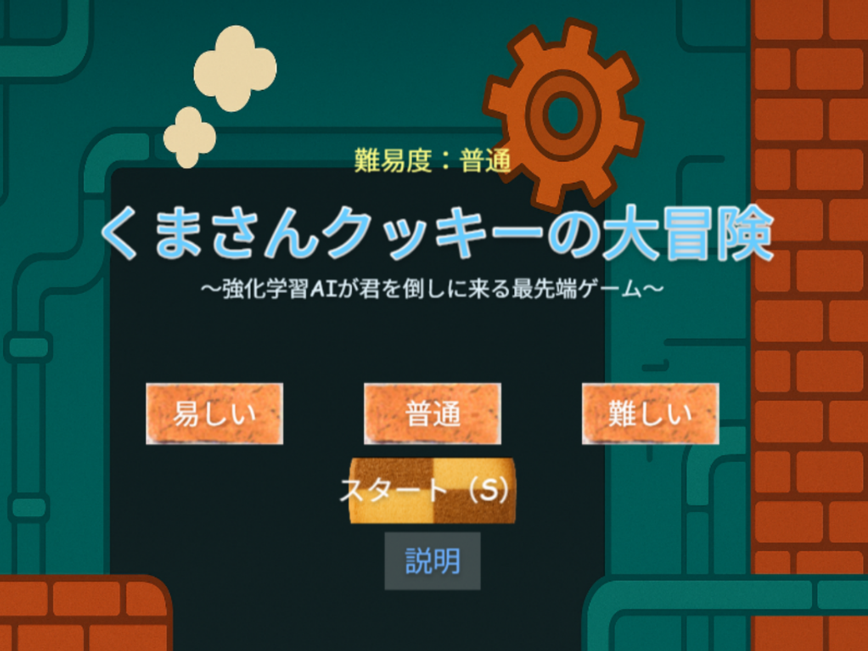

# typescript-game
TypeScriptで制作したゲーム

# Kuma Cookie Adventure（くまさんクッキーの大冒険）

## 概要
本作品は **TypeScript + Phaser 3** を用いて制作した  
横スクロール型アクションゲームです。

プレイヤーはクッキーキャラクターを操作し、  
床のギミックや敵を回避しながら  
ゴール地点（トースター）を目指します。

本ゲームの特徴は、プレイヤーの行動に応じて  
**難易度が自動的に変化するAIシステム**を搭載している点です。

---

## 使用技術
- TypeScript
- Phaser 3
- Vite

---

## プレイリンク
以下のURLからブラウザ上でプレイできます。

https://tanabe-1207.github.io/typescript-game/

---

## ゲーム画面 / 説明動画

以下のリンクからゲームプレイ動画を確認できます。  

※ 画像をクリックすると動画が再生されます  
[▶ ゲーム説明動画を見る](typeScript-game.mp4)

---

## 操作方法
- ← →：左右移動
- ↑：ジャンプ
- P：飛行モード ON / OFF
- O：上昇
- L：下降

---

## ゲームの特徴
- 横スクロール型アクションゲーム
- プレイヤー行動に応じて変化する **動的難易度調整AI**
- ε-greedy戦略を用いたギミック選択
- 多様な床ギミック（スライド・落下・消失など）
- 複数の敵キャラクター（プリン・グミ・ポッキーなど）
- プレイ状況の可視化（HUD表示）

---

## 敵・ギミック
### 床ギミック
- スライド床
- 奈落落下
- 消失床
- 段差（上昇・下降）

### 敵キャラクター
- プリン
- 高速プリン
- ジャンプグミ
- 飛行ポッキー

ゲームが進行するほど、  
ギミックの頻度や難易度が上昇します。

---

## AI（動的難易度調整）
プレイヤーの行動ログを取得し、  
ゲーム難易度をリアルタイムで調整します。

### 使用データ
- ジャンプ頻度
- 移動距離
- 回避率
- クリアタイム

### アルゴリズム
- ε-greedy探索
- バンディット更新（報酬ベース）

### 特徴
- プレイヤーの「クセ」に応じたゲーム変化
- 毎回異なるゲーム体験を実現

---

## ゲームの流れ
1. ホーム画面（難易度選択）
2. 操作説明画面
3. ゲームプレイ
4. ゴールまたはゲームオーバー

---

## プレイ方法（ローカル）
1. Node.js をインストール
2. 以下を実行 
   npm install npm run dev
3. 表示されたURLをブラウザで開く

---

## 制作期間
約4～5週間(個人制作)

---

## 工夫した点
- プレイヤー行動に基づく難易度調整システムの実装
- ε-greedy戦略による動的なゲーム展開
- UI/UX設計（難易度選択・操作説明の導線）
- 視覚的フィードバック（ギミック表示）
- 多様なギミックと敵の組み合わせによる飽き防止